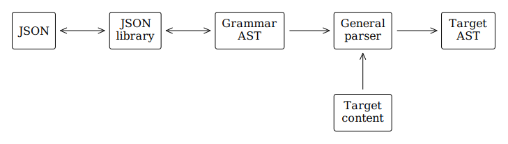

# banteng

Banteng is an attempt at a parser that uses JSON encoded [BNF](https://en.wikipedia.org/wiki/Backus–Naur_form) grammars to parse text into JSON.
If this ever goes anywhere `banteng.py` would only be a reference implementation, the [grammar format](grammar.md) would contain all canonical definitions.

## The problem

Here's the architecture for every BNF based general parser I've ever written:

Alas, my previous attempts at parsers always ended in failure.
Amongst the many reasons were three that stood out:

- Every implementation required two parsers - one to parse the actual grammar definition, and the other to parse the target content.
- Working in multiple languages required reimplementing both parsers in every new language.
- There was approximately zero chance anyone would ever add grammars to my project so I'd have to write them *all* myself.

## A solution

[tl;dr](https://en.wiktionary.org/wiki/tl;dr) encode the grammar in [JSON](https://www.json.org).
Parsers for JSON exist in practically every language; it's not as pretty as laid out BNF, but it counters that with shear popularity.
As you can see from the previous diagram, all my earlier attempts at parsers could dump their parsed grammars to JSON for debugging purposes - you'd think I'd have noticed earlier.

Here's the revised architecture for a JSON based general parser:

## Notes

The `grammars` folder contains a few examples from an older project which used grammars in their original BNF form.
I've dded them here along with a non-functional conversion to JSON.
It's worth noting that in the old project the hardcoded BNF parser only occupied nearly 300 lines.

## Other projects

- [KDE syntax-highlighting](https://github.com/KDE/syntax-highlighting/tree/master/data/syntax) - XML, regular expressions
- [PrismJS / prism](https://github.com/PrismJS/prism/tree/master/components) - JavaScript, regular expressions
- [KGT: Kate's Grammar Tool](https://github.com/katef/kgt) Converts various BNF-like syntaxes to various BNF-like syntaxes, AST dumps, and Railroad Syntax Diagrams.
